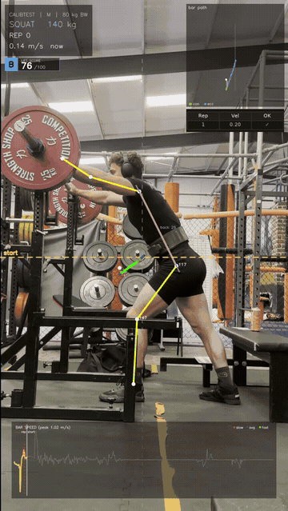
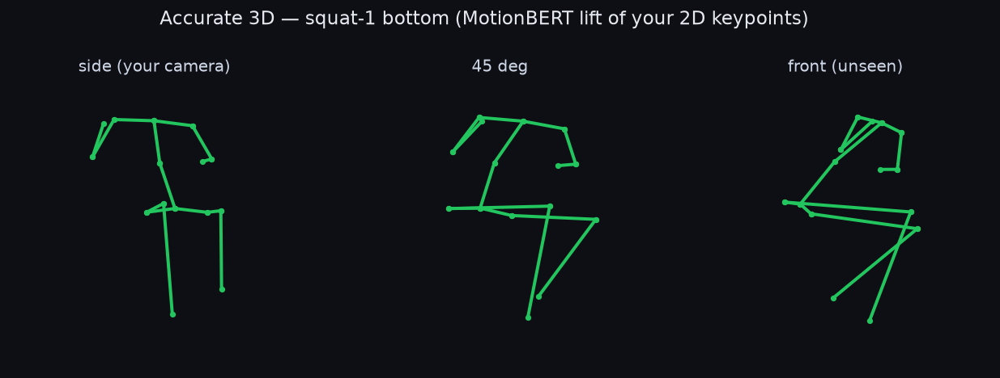
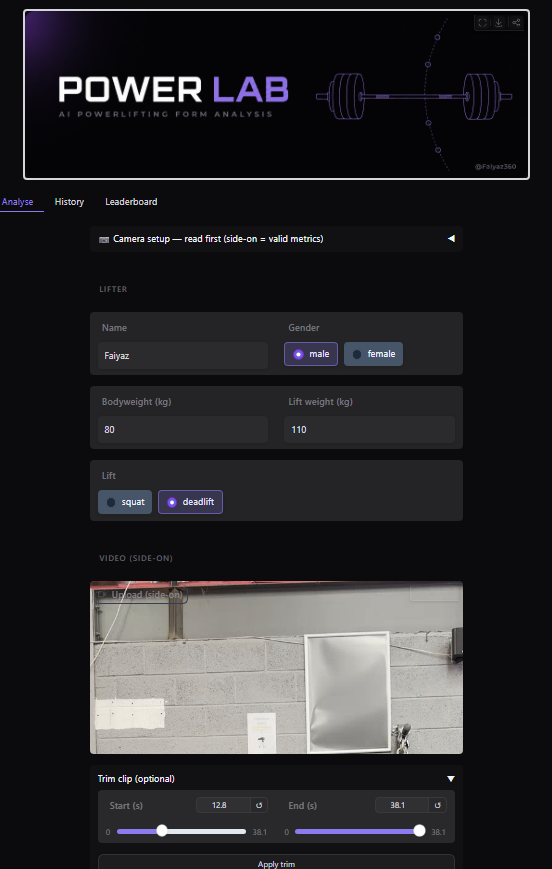
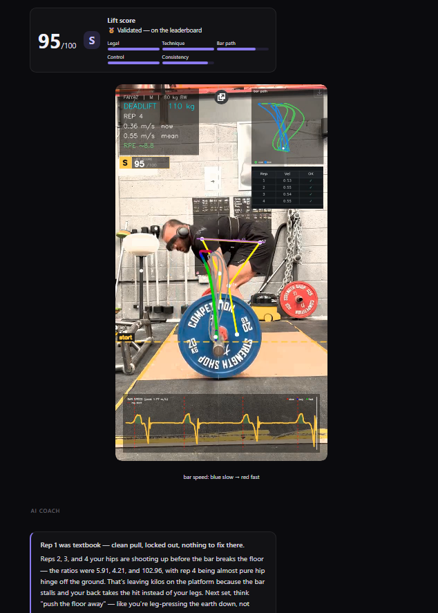
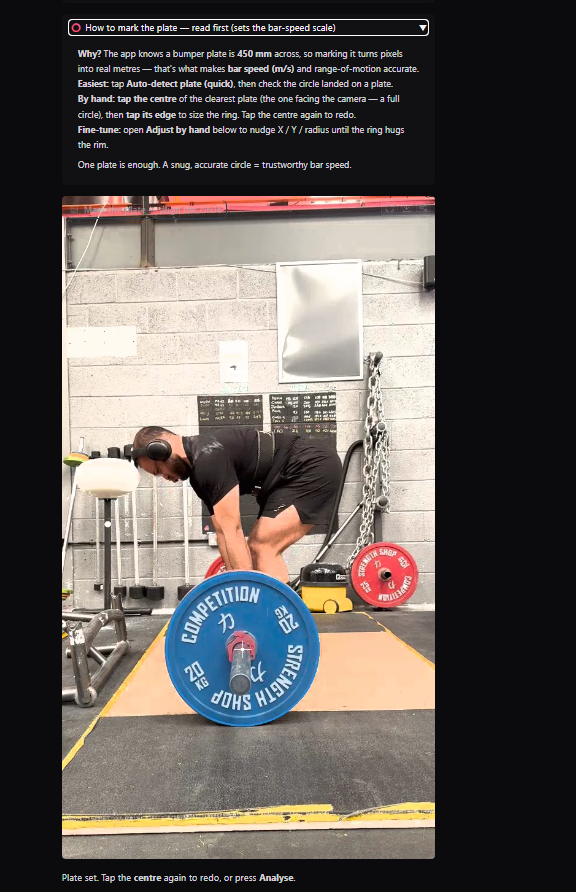
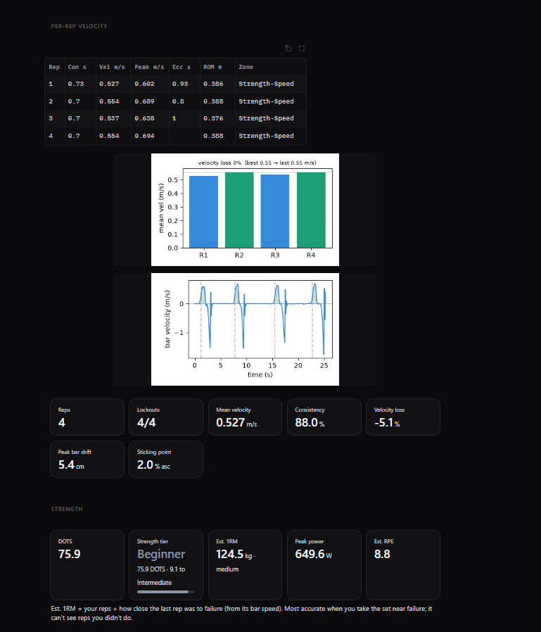
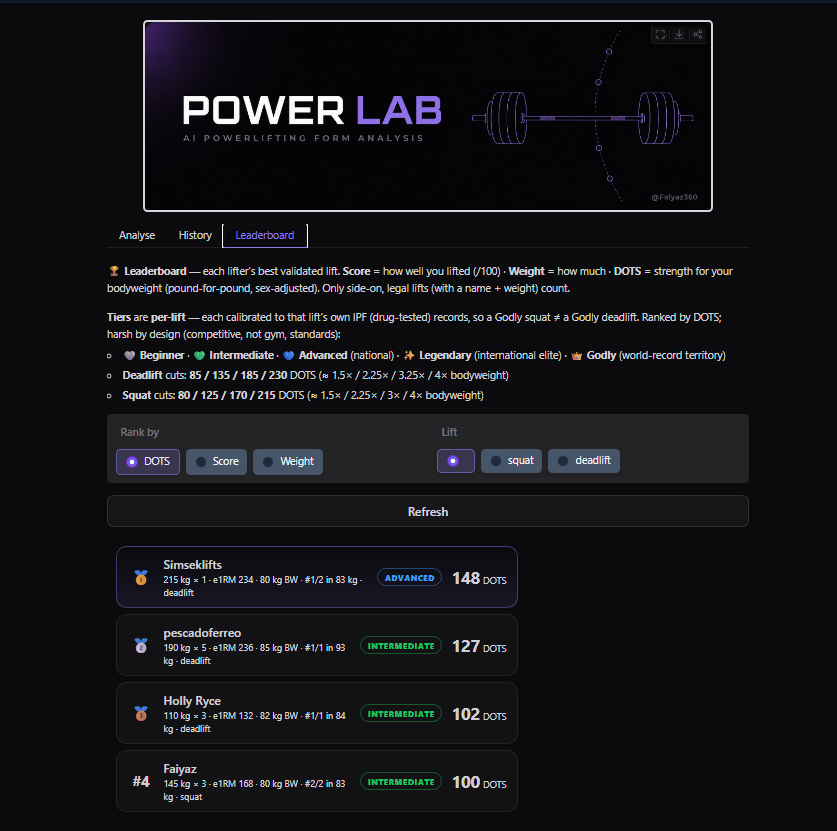
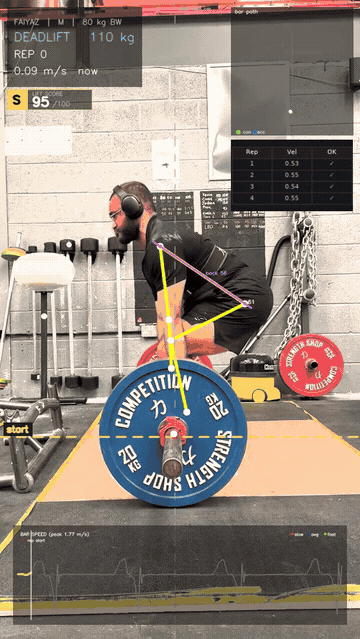

# PowerLab — Powerlifting Form Analysis

Upload a side-on lift video → a vision model tracks your body and the barbell → get coaching
feedback and metrics: squat depth, joint angles, bar path, bar speed (VBT), a /100 score, and a
strength leaderboard. No wearables, no extra hardware — just your phone camera.

**▶ Try it live:** **[PowerLab on Hugging Face Spaces](https://huggingface.co/spaces/Faiyaz360/Power-Lab)**



> *A squat analysed — live skeleton + joint angles, depth, bar path, bar speed (VBT), and a running
> /100 score. [▶ Watch the full clip](assets/demo/squat-analysis.mp4).*

**The guiding principle is honesty.** The camera must be side-on for 2D angles to be valid, so an
**off-axis gate** refuses to judge a clip it can't measure honestly, coaching cues are **deterministic**
(an LLM only *phrases* faults the code already detected — it never invents them), and every estimate
(3D, velocity→RPE) is labelled as an estimate.



> *A squat lifted to 3D (MotionBERT) — side / 45° / front. The front view is the plane a side-on
> camera physically can't see.*

---

## Features

- **Pose + angles** — 2D body tracking (MediaPipe BlazePose or YOLO-pose, swappable behind `pose.py`);
  knee/hip/torso angles, squat **depth** (IPF: hip-crease below the knee), deadlift **lockout**
  (IPF 2026: erect torso + locked knees), rep detection.
- **Off-axis honesty gate** — quantifies how side-on the camera is and withholds a verdict when the
  view is too angled to measure honestly.
- **Barbell tracking + VBT** — optical-flow plate tracking calibrated by the 450 mm plate → bar path
  and mean concentric velocity → **RPE** and **e1RM** (Brzycki), anchored to published 1RM
  minimum-velocity thresholds and **calibratable to each lifter's own logged maxes**.
- **Scoring + leaderboard** — a gamified **/100** execution score; a **DOTS** leaderboard with
  per-lift strength **tiers** (anchored to drug-tested IPF records) and within-weight-class rank.
- **Coaching (deterministic)** — faults are detected by code against IPF/strength-science thresholds;
  an optional LLM only rewrites them as plain-English cues (keyless rule-based fallback if no API key).
- **History + autoregulation** — local SQLite history, progress trends, personal bests, and a
  per-lift **load-velocity profile** ("what weight today?").
- **Ghost compare** — overlay your current rep against your best-ever rep at the key frame.
- **Rich on-video overlays** — skeleton, live joint angles, bar path, a real-time velocity graph, a
  depth/lockout badge, and a per-rep table.
- **Optional 3D (Phase 3)** — lifts the 2D keypoints to 3D (MotionBERT) for depth and left/right
  symmetry the side view can't show. Offline, opt-in, clearly labelled as an estimate.

## How it works

```
video ─► pose.py            2D keypoints (MediaPipe / YOLO, swappable)
      ─► metrics + faults   depth, angles, reps, IPF-rule checks  (deterministic)
      ─► confidence gate     is the camera side-on enough to judge?
      ─► coach.py            LLM phrases the detected faults (never invents)  [optional]
      ─► render + report     annotated video + report.md + metrics.json + charts
```

The model is hidden behind `pose.py`, so the rest of the pipeline is model-agnostic. The same
`pipeline.py` powers both the local CLI and the Gradio web app.

## Quickstart

```bash
# 1. install (Python 3.11+)
python -m venv .venv
# Windows: .venv\Scripts\python.exe   ·   macOS/Linux: .venv/bin/python
python -m pip install -r requirements.txt

# 2. analyse a clip from the command line
python cli.py input/squat.mov --lift squat        # or --lift deadlift

# 3. or run the web app
python app.py                                     # → http://127.0.0.1:7860
```

Results (annotated MP4, `report.md`, `metrics.json`, charts) land in `output/`.

Optional: copy `.env.example` to `.env` to enable the LLM coach (`OPENROUTER_API_KEY`). Without it,
the built-in rule-based cues are used.

## Using the web app

1. Open the app — the [live demo](https://huggingface.co/spaces/Faiyaz360/Power-Lab) above, or run `python app.py` locally.
2. On the **Analyse** tab, enter your **name, bodyweight, lift, and lift weight**.
3. Upload a **side-on** video of your set.
4. **Tap the centre of a plate, then its edge** to mark the barbell (this drives the bar-speed tracker).
5. Press **Analyse** → annotated video, /100 score, coaching cues, a depth/lockout verdict, and charts.
6. A valid side-on, named, weighted lift is added to the **Leaderboard** (DOTS + strength tier).

## Screenshots

<table>
<tr>
<td width="50%"><br><sub><b>Analyse</b> — enter your details and upload a side-on clip</sub></td>
<td width="50%"><br><sub><b>Scored analysis</b> — annotated video, a /100 score, and coaching</sub></td>
</tr>
<tr>
<td><br><sub><b>Coaching</b> — deterministic cues that only phrase the faults the pipeline detected</sub></td>
<td><br><sub><b>Metrics</b> — per-rep velocity, bar-speed charts, DOTS / e1RM / peak power / RPE</sub></td>
</tr>
</table>

<br><sub><b>Leaderboard</b> — DOTS (pound-for-pound, sex-adjusted), with per-lift strength tiers</sub>

## Examples

A deadlift analysed — live skeleton + bar path, per-rep velocity, a lockout check, and coaching cues:



[▶ Watch the full clip](assets/demo/deadlift-analysis.mp4) (the squat example is up top).

## Recording guide (garbage in → garbage out)

- Camera **dead side-on** (the plate edge-on), on a tripod, ~hip height. Off-axis foreshortens every
  2D angle — the honesty gate will flag it.
- Whole body **and** barbell in frame, decent lighting, plain-ish background.
- **60 fps** if your phone allows it (120 for cleaner velocity).

## Tests

```bash
python -m pytest
```

## Project layout

```
app.py              # Gradio web app (Analyse / History / Leaderboard / Settings)
cli.py              # local command-line entry point
src/
  pipeline.py       # orchestrates a full analysis run (used by both entry points)
  pose.py           # MODEL INTERFACE — MediaPipe / YOLO, swappable
  angles.py         # joint-angle math (law of cosines, unit-tested)
  metrics.py        # depth, rep detection, tempo, deadlift lockout
  faults.py         # deterministic thresholds -> structured issue list
  advanced_metrics  # DOTS, velocity->RPE, e1RM, peak power, sticking point
  lv_profile.py     # load-velocity profile + per-lifter MVT calibration
  confidence.py     # off-axis honesty gate
  score.py          # /100 execution score + leaderboard-validity gate
  strength_standards# per-lift DOTS tiers + IPF weight classes
  barbell.py        # plate tracking + bar velocity (VBT)
  coach.py          # detected faults -> coaching cues (LLM phrasing, rule fallback)
  history.py        # local SQLite history + leaderboard queries
  charts.py         # angle / velocity / bar-path plots
  ghost.py          # current-vs-best rep overlay
  render.py         # draws the annotated video
  report.py         # report.md + metrics.json
  lift3d.py         # 2D -> 3D lift (MotionBERT) — Phase 3, optional
  _motionbert/      # vendored MotionBERT model (Apache-2.0)
tests/              # unit tests
docs/               # design docs
colab/              # training / evaluation notebooks
input/  output/     # your videos / results (git-ignored)
```

## Built on

- **MotionBERT** (Apache-2.0) for the 2D→3D lift — <https://github.com/Walter0807/MotionBERT>
- **MediaPipe** BlazePose and **Ultralytics YOLO** for 2D pose
- **OpenCV**, **NumPy**, **matplotlib**, **Gradio**, **pytest**
- Rules and science: the **IPF Technical Rulebook** for legality; velocity-based-training research
  (Helms et al. 2017; González-Badillo & Sánchez-Medina) for the RPE/MVT anchors.

## License

MIT — see [LICENSE](LICENSE). The vendored MotionBERT model in `src/_motionbert/` is Apache-2.0.

## Disclaimer

Thresholds are **heuristics** — calibrate them per lifter. 3D and velocity-derived numbers (RPE,
e1RM) are **estimates**. This is a personal learning project, not medical advice or a substitute for
a qualified coach or judge.
